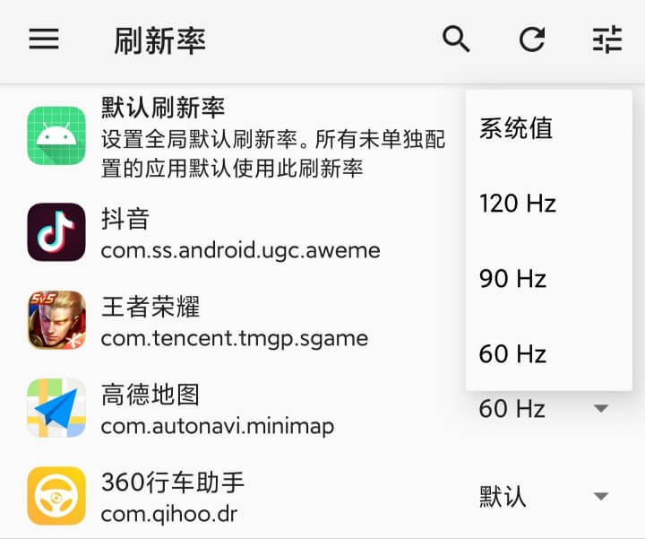
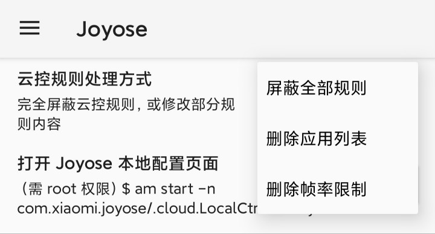

# MIUI 性能救星
> 移除 MIUI 对应用的性能限制，以最高帧率运行应用

## 介绍
本模块旨在用各种方式提升系统运行应用的性能。
目前支持的功能：
- 对指定应用解除 MIUI 系统 "电量与性能" 应用云控限制屏幕刷新率。对于 DC 调光和高刷新率不兼容的情况，支持强行锁定 “DC+高刷” 或低亮度时自动切换到支持 DC 的刷新率
  > "电量与性能" 应用会根据前台应用情况，限制应用的运行帧数。比如王者荣耀等游戏会被限制 60 刷新率，导致游戏最高只能达到 60 帧
 
  
- 屏蔽或修改 MIUI 系统 "Joyose" 应用的云控性能限制，屏蔽其广告和跟踪请求
  > "Joyose" 应用会拉取云控规则，调整应用的性能。比如在手机温度较高时降低游戏帧数

  

## 使用方式
1. 安装 MIUIPerfSaver.apk [MIUI 性能救星]
2. 在 LSPosed 管理器中启用模块
   - 首次启用模块、更新模块版本时，需要强制停止 "性能与电量" / "Joyose" 应用一次
   - 首次启用需清空 "Joyose" 全部数据
3. 在 MIUI 性能救星 模块自己的设置中
   - 刷新率：可修改全局刷新率，或锁定单个应用的刷新率。这里的改动立即生效，重启也仍然生效，无需强制停止任何应用
   - Joyose：选择云控规则处理方式，默认完全屏蔽，可选仅删除部分云控规则内容

## 反馈 bug
请在 https://github.com/test01wrk/MIUIPerfSaver/issues 创建 issue，并提供 LSPosed 管理器中的详细日志

## 感谢
应用列表界面的 UI 和基础逻辑，改自 [XAppDebug](https://github.com/Palatis/XAppDebug) 项目

## 已知问题
- MIUI 开发版、测试版系统上可能失效，目前只适配正式版系统
- DC 高刷不兼容的设备强制同时开启 DC + 高刷后，可能出现屏幕颜色偏色、部分刷新率下 DC 无效等情况

---

# MIUI Performance Saver
> Remove MIUI\'s performance limit, run app at maximum FPS

UI from [XAppDebug](https://github.com/Palatis/XAppDebug), thanks~

